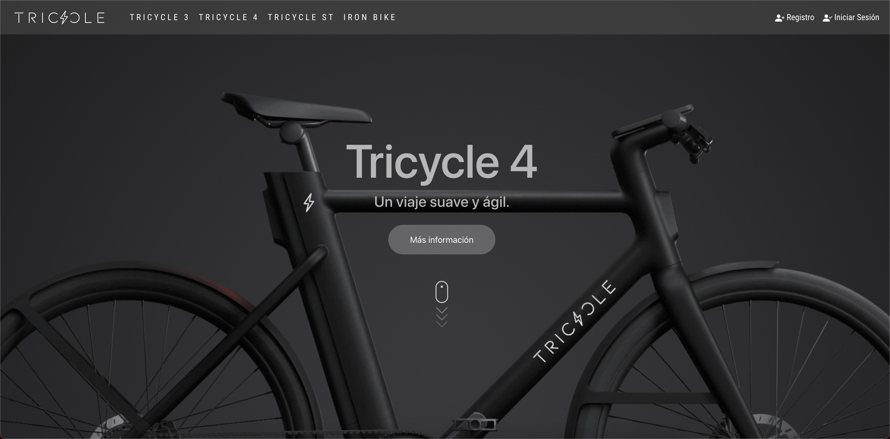
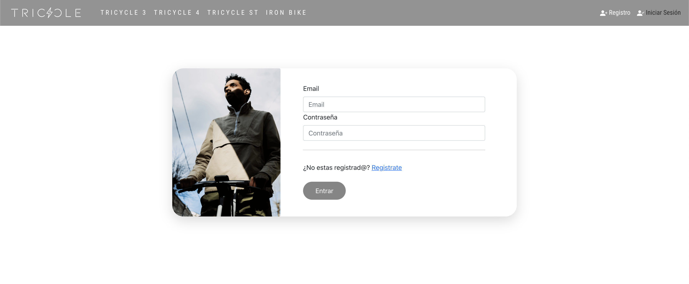
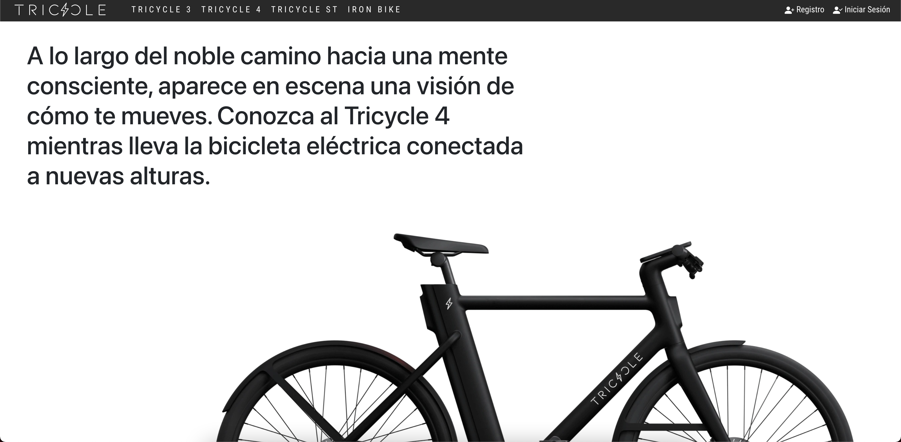
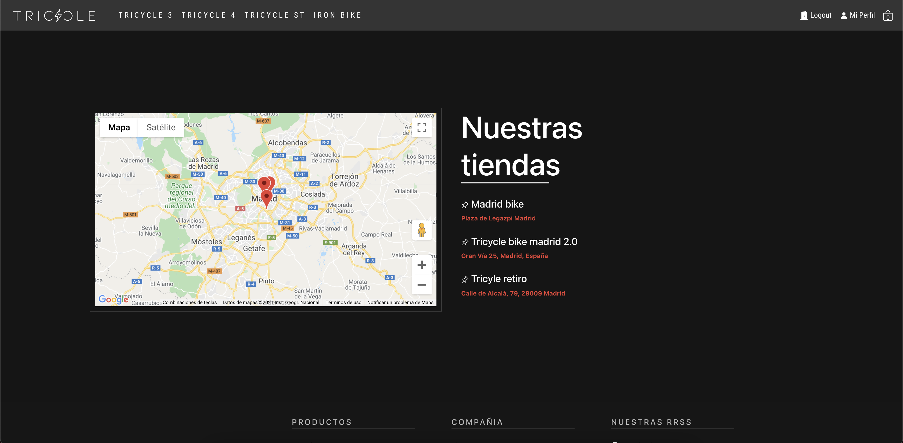
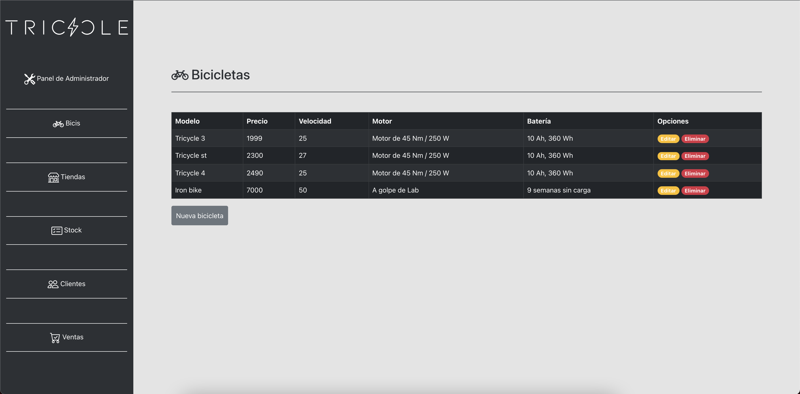

# Tricycle Project

## Project Description
Market place application for electric design bicycles.

## SET UP   🚀

Through the terminal, go to the server folder and download the necessary dependencies. Then go to the client folder and download the corresponding dependencies. To do this, just run the following command in the terminal in each folder:
```
npm install
```
This command will download all the dependencies necessary for the application to start.

After downloading the dependencies, it is necessary to implement the .env file in both folders. Where you will have to include the following, 

On server:

```
PORT = Here you will include the port you want your application to be on e.g. 5005.
ORIGIN = Include the URL of your localhost: http://localhost:3000
MONGODB_URI = The URL of your database, in our case we used mongoDB
SESS_SECRET = whatever
STRIPE_KEY= Key to your Stripe account
CLOUDINARY_NAME = Your Cloudinary user name
CLOUDINARY_KEY = Key to your Cloudinary account
CLOUDINARY_SECRET = Secret key of your Cloudinary account
```
On client:
```
REACT_APP_API_URL = Api URL
REACT_APP_API_KEY_MAPS = Key to your google maps api
REACT_APP_API_KEY_STRIPE_PUBLIC = Key to your stripe api
```

In your terminal go to the client root and run following the command:

```
npm run start
```

In your terminal go to the server root and run following the command:

```
npm run dev
```

You are now ready to use the application!!


## Some screenshots of the application: 📷

### Home page:



### Login Page:



### Bike Page:


### Bike details:



### Our shops page:



### Admin bikes page:




## Endpoints


### Back-end Endpoints

| Routes file | Method                    | Endpoint                       | Action                                           | 
| ----------- | ------------------------- | ------------------------------ |------------------------------------------------- |
| Auth 
|             | POST                      | /api/auth/signup               | User register                                    |
|             | POST                      | /api/auth/login                | User login                                       |
|             | GET                       | /api/auth/logout               | User logout                                      |
|             | POST                      | /api/auth/isloggedin           | Check if user is logged in                       |
| Bikes
|             | GET                       | /api/bikes                     | Find bikes                                       |
|             | GET                       | /api/bikes/last-bike           | Find the last bike created                       |
|             | GET                       | /api/bikes/:id                 | Bikes details                                    |
|             | POST                      | /api/bikes                     | Create Bike                                      |
|             | PUT                       | /api/bikes/:id                 | Update Bike                                      |
|             | DELETE                    | /api/bikes/:id                 | Delete Bike                                      |
| Shops
|             | GET                       | /api/shop                      | Find all shops                                   |
|             | GET                       | /api/shop/:id                  | Find by id a shop                                |
|             | POST                      | /api/shop                      | Create shop                                      |
|             | PUT                       | /api/shop/:id                  | Update shop                                      |
|             | DELETE                    | /api/shop/:id                  | Delete shop                                      |
| Cart
|             | GET                       | /api/cart                      | Find one cart by user Id                         |
|             | PUT                       | /api/cart/push                 | Update cart by adding a product                  |
|             | PUT                       | /api/cart/pull                 | Update cart by removing a product                |
|             | PUT                       | /api/cart/empty-cart           | Update cart by removing all products             |
|             | PUT                       | /api/cart/buy                  | Create invoice according to cart and empty cart when purchase is made |
| User
|             | GET                       | /api/user                      | Fins user                                        |
|             | GET                       | /api/user/:id                  | Find user by id                                  |
|             | PUT                       | /api/user/:id                  | Update user by id                                |
|             | DELETE                    | /api/user/:id                  | Delete user                                      |
| Bill
|             | GET                       | /api/bill/all-bills            | Get a bill by id                                 |
|             | GET                       | /api/bill/:billId              | Get all bills                                    |
| Stripe
|             | POST                      | /api/checkout                  | Payment route                                    |
| Uploads
|             | POST                      | /api/uploads/image             | Claudinary route                                 |


### Front-end Endpoints

| Routes file | Path                       | Action                                            | 
| ----------- | -------------------------- |-------------------------------------------------- |
| Base 
|             | /                          | Render home page                                  |
|             | /contacto                  | Render contact page                               |
|             | /sobre-nosotros            | Render about us page                              |
|             | /creadores                 | Render creators page                              |
|             | /creadores-img             | Render creators image page                        |
| User                                                                                                          
|             | /registro                  | Render user register page                         |
|             | /iniciar-sesion            | Render user login page                            |
|             | /perfil                    | Render user profile  page                         |
|             | /editar-perfil/:id         | Render edit user profile page                     |
|             | /carrito                   | Render cart page                                  |
|             | /comprar                   | Render payment page                               |
| ADMIN
|             | /admin-panel               | Render home admin page                            |
|             | /lista-clientes            | Render list of clients                            |
| Admin Bikes
|             | /bici/:id                  | Render bikes details page                         |
|             | /nueva-bici                | Render create bike page                           |
|             | /editar-bici/:id           | Render update bike page                           |
|             | /editar-stock/:id          | Render update bike stock page                     |
|             | /lista-bicis               | Render all bikes page                             |
|             | /stock                     | Render all bikes stock page                       |
|             | /:bike                     | Render a bike page by id                          |
| Admin Shops
|             | /lista-tiendas             | Render all shops page                             |
|             | /nueva-tienda              | Render create shop page                           |
|             | /editar-tienda/:id         | Render update shop page                           |
| Admin Sales
|             | /ventas                    | Render sales page                                 |
|             | /detalles-ventas           | Render sales details page                         |


If you just want to see the final result of the SAP you can click here: 

👉👉  https://tricycle-bike.herokuapp.com/ 